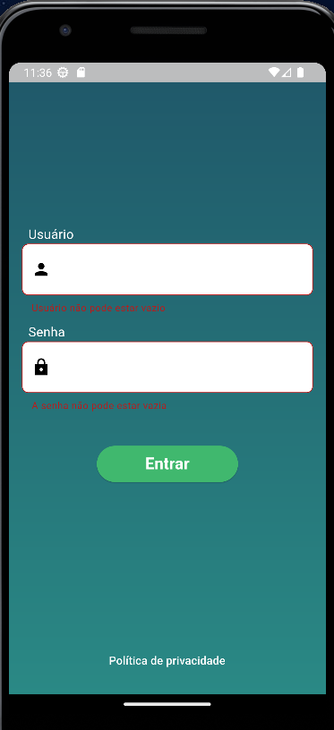
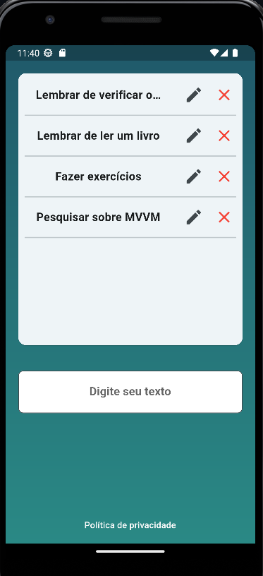
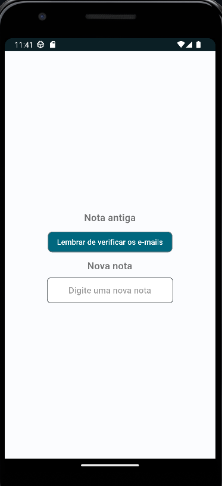
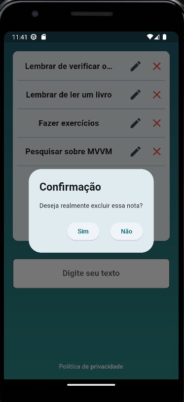

# 🚀 Login App

O projeto consiste em uma aplicação que realiza um login, após passar em todas as validações de campo. Ao logar, você poderá criar, editar e remover notas, que serão persistidas de forma local no seu smartphone. Então relaxe, e divirta-se utilizando o app.

## 📱 Screenshots

| Tela de Login                | Tela de Captura de Informações   | Tela de Atualização                    | Tela de remoção                   |
|:----------------------------:|:--------------------------------:|:-----------------------------:|:-------------------------------:|
|  |  |  |  |


## ✨ Funcionalidades

- Logar no aplicativo após a validação dos campos.
- Criar uma nova nota.
- Editar uma nota.
- Remover uma nota.
- visualizar todas as notas.

## 💻 Como Executar o app

```bash
git clone git@github.com:Brennez/Desafio-Target-Sistemas.git

cd seu-repositorio

flutter pub get

flutter run
```

## Tecnologias Utilizadas

[](https://flutter.dev/)
[](https://dart.dev/)
[](https://pub.dev/packages/flutter_mobx)

## Contribuição

1. Faça um Fork do projeto
2. Crie uma nova branch (`git checkout -b feature/nova-feature`)
3. Faça commit das suas mudanças (`git commit -am 'Adiciona nova feature'`)
4. Faça push para a branch (`git push origin feature/nova-feature`)
5. Abra um Pull Request

# Contato

[](https://www.linkedin.com/in/tchalisson-brenne-27911421b/)
[](https://github.com/Brennez)
[](mailto:tchalisantos40@gmail.com)


